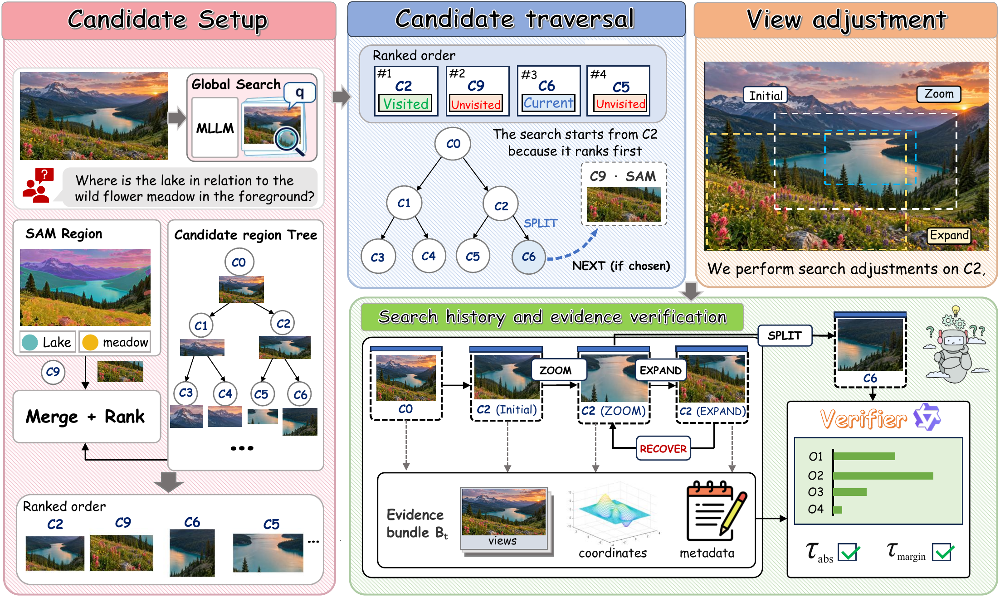

# CAREER

**Multi-Granularity Visual Search with Verification Feedback** is a training-free method for high-resolution visual question answering. CAREER combines whole-image prediction with local visual search and verification feedback. When more visual evidence is needed, it uses SAM 3 and SGAP to obtain informative image regions.

This repository contains the CAREER inference code, model adapters, and prompts.

## Overview



## Environment

- Python 3.11 or later
- PyTorch 2.7 with a CUDA build compatible with your NVIDIA driver (for GPU inference)
- Dependencies listed in `requirements.txt`

Create a Python environment and install the project dependencies:

```bash
python -m venv .venv
source .venv/bin/activate
python -m pip install --upgrade pip
pip install -r requirements.txt
```

## Models

Download model checkpoints from their official model pages and keep them outside this repository.

| Component | Model |
| --- | --- |
| Generator options | [Qwen2.5-VL-7B-Instruct](https://huggingface.co/Qwen/Qwen2.5-VL-7B-Instruct), [InternVL2.5-8B](https://huggingface.co/OpenGVLab/InternVL2_5-8B), or [LLaVA-OneVision-7B](https://huggingface.co/lmms-lab/llava-onevision-qwen2-7b-ov) |
| Verifier | [Qwen3-VL-4B-Instruct](https://huggingface.co/Qwen/Qwen3-VL-4B-Instruct) |
| Image segmentation | [SAM 3](https://github.com/facebookresearch/sam3) |
| Text-image features | [CLIP ViT-L/14](https://huggingface.co/openai/clip-vit-large-patch14) |

## Repository Structure

| Path | Description |
| --- | --- |
| `career/search.py` | Search controller, evidence accumulation, verification, and stopping logic |
| `career/frontend.py` | SAM 3, SGAP, CLIP, and candidate ranking |
| `career/models.py` | Vision-language model adapters |
| `career/prompts.py` | Planning, navigation, answering, and verification prompts |
| `career/config.py` | Search and runtime configuration |
| `tests/` | Functional tests |

## Acknowledgements

CAREER builds on ideas and components from [CVSearch](https://github.com/liliupeng28/ICML26-CVSearch), [ZoomEye](https://github.com/om-ai-lab/ZoomEye), [SAM 3](https://github.com/facebookresearch/sam3), and [LLaVA-NeXT](https://github.com/LLaVA-VL/LLaVA-NeXT).
